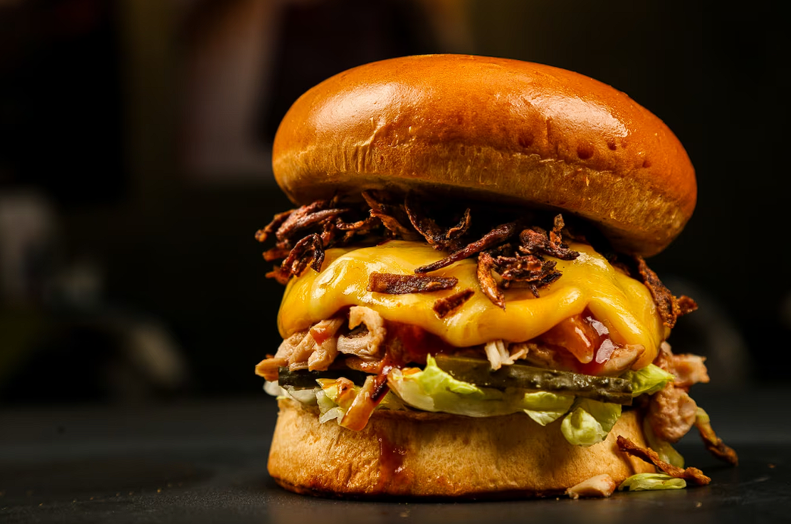
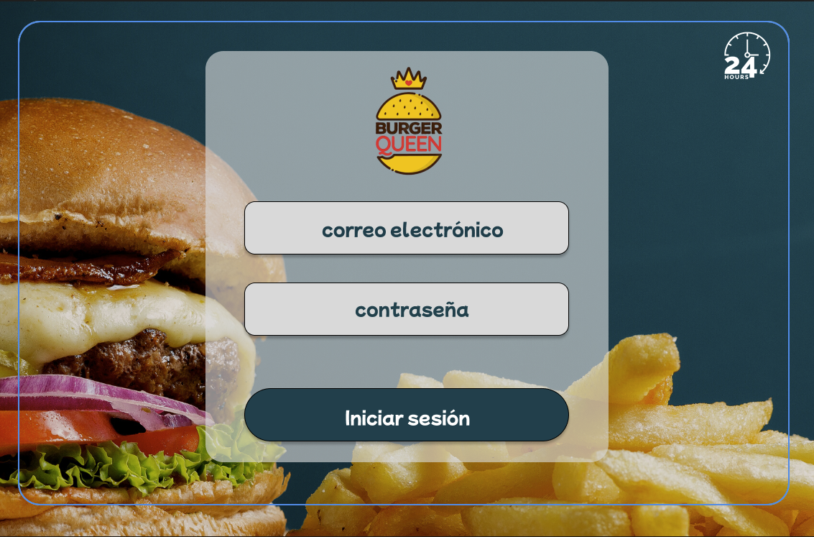
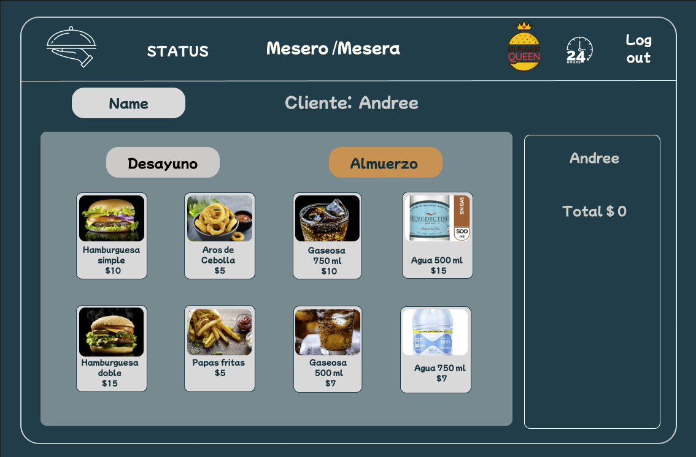
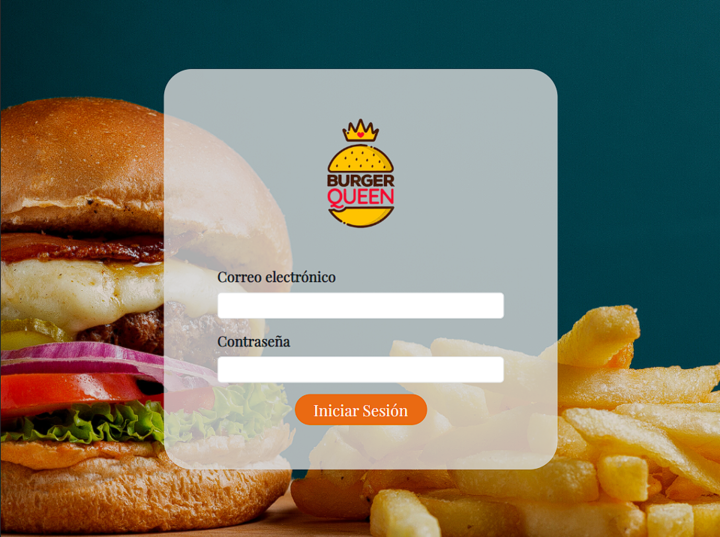
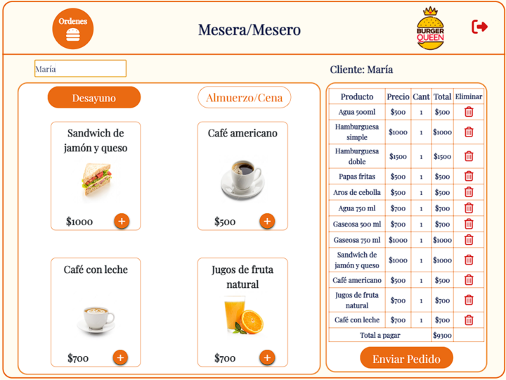
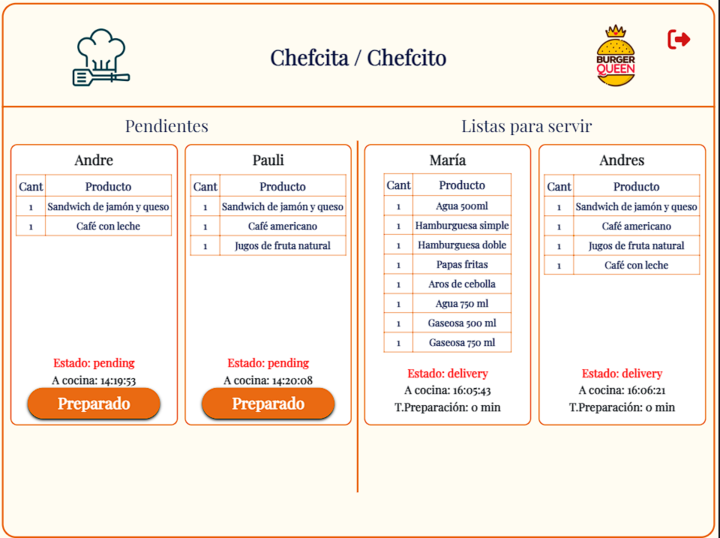

# Burger Queen API Client 👑

## Preambulo

React JS es un potente y popular framework de desarrollo front-end que nos permite construir aplicaciones web de manera eficiente y escalable. Su enfoque basado en componentes y el manejo del estado en tiempo real nos brinda la posibilidad de crear interfaces interactivas y dinámicas. En este proyecto, nos hemos embarcado en la emocionante tarea de construir una interfaz para un restaurante de hamburguesas llamado Burger Queen, la UI está desarrollada para ser usada en formato tablet (recomendamos en forma horizontal). Nuestro objetivo es desarrollar una solución que les permita tomar pedidos de manera ordenada y eficiente, mejorando la experiencia tanto para el cliente como para el personal de cocina.

## Resumen del proyecto

Bienvenidos a Burger Queen, una cadena de comida 24 horas que ha tenido una excelente acogida gracias a su propuesta de servicio continuo. Sin embargo, nuestro éxito nos presenta nuevos desafíos, y para seguir creciendo, requerimos de un sistema que facilite la toma de pedidos de nuestros clientes. En este proyecto, nos hemos encargado de desarrollar la interfaz del sistema de Burger Queen, que permite tomar pedidos, cambiar su estado y administrador productos y trabajadores. Esta interfaz se integrará con una API (servidor) existente.

Nuestra clienta nos ha proporcionado dos menús: A continuación, se presentan los dos menús disponibles:

#### Menú de Desayuno

| Ítem                      | Precio|
|---------------------------|-------|
| Café americano            | $500  |
| Café con leche            | $700  |
| Sandwich de jamón y queso | $1000 |
| Jugo de frutas natural    | $700  |

#### Menú Resto del Día

| Ítem                     | Precio|
|--------------------------|-------|
| Hamburguesa simple       | $1000 |
| Hamburguesa doble        | $1500 |
| Papas fritas             | $500  |
| Aros de cebolla          | $500  |
| Agua 500ml               | $500  |
| Agua 750ml               | $700  |
| Bebida/gaseosa 500ml     | $700  |
| Bebida/gaseosa 750ml     | $1000 |

## Historias de usuario

1. Como mesero, deseo ver los menús de desayuno y resto del día con todos sus productos disponibles, para poder elegir qué deseo ordenar.

2. Como mesero, quiero agregar productos de ambos menús a mi pedido, y ver cómo se actualiza el resumen con el costo total de mi compra.

3. Como mesero, deseo tener la opción de cambiar la cantidad de productos en mi pedido o eliminar algún ítem que haya seleccionado previamente.

4. Como mesero, deseo tener una interfaz intuitiva y de fácil uso que me permita navegar entre las diferentes secciones y opciones del menú.

5. Como chef, deseo poder revisar el pedido que debo preparar y cambiar su estado a preparado.
6. Como mesero, deseo poder revisar los pedidos que están listos para entregar y cambiar su estado a entregados.
7. Como administrador, deseo poder revisar la lista de productos disponibles, agregar y eliminar productos nuevos al menú, y editar el nombre, imagen, valor o disponibilidad del producto según corresponda.
8. Como administrador, deseo poder revisar la lista de trabajadores, agregar y eliminar trabajadores y editar sus credenciales y funciones según corresponda.

Todas nuestras historias de usuario, cumplen los las siguientes definiciones de terminado:

- Se recibió code review de compañeras.
- Se realizó test unitarios.
- Hicimos tests de usabilidad e incorporaste el feedback del usuario.
- Desplegamos la aplicación con Vercel y hemos etiquetado la versión (git tag).

Para interactuar con la aplicación:
- Abrir el siguiente link donde se encuentra desplegada la [API REST](https://burgerqueen-apimock-andreypauli.onrender.com/). 
- Luego abrir el enlace donde se encuentra la [aplicación desplegada](https://dev-005-burger-queen-api-client-git-master-paulivega.vercel.app/
).
- Utilizar alguno de los siguientes usuarios para identificarse:

| Usuario                | Contraseña| Rol            |
|------------------------|-----------|----------------|
| mesero@burgerqueen.com |   123456  | Mesero         |
| chef@burgerqueen.com   |   123456  | Chef           |
| admin@burgerqueen.com  |   123456  | Administrador  |

## Prototipos de alta fidelidad

Para brindar una experiencia visual clara y atractiva, hemos desarrollado prototipos de alta fidelidad que representan la interfaz del sistema. Estos prototipos contienen las interacciones y elementos necesarios para cumplir con las historias de usuario definidas.

A continuación, se presentan las imagenes de los prototipos:

## Interfaz de Usuario

### Producto final

#### Inicio de sesión

#### Mesero/Mesera

#### Chef

